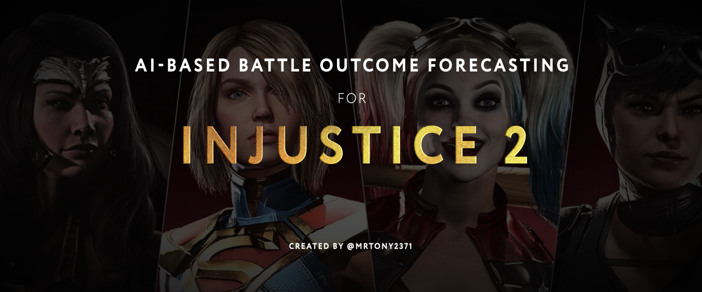

The goal of the project to achieve at least top100 rank in online AI Battle simulator in **Injustice 2** fighting game. 

The project involves computer vision techniques (without neural networks) to collect game info from raw pixel data. This data is stored in the SQLite database. It includes information about fighters' levels and their AI parameters. Collected data is used to train neural network to predict match outcome based on fighter characteristics. It can also suggest how to tweak AI settings to maximize your fighting advantage in a particular encounter.

Modules description:
**classes_and_functions.py**
Module contains classes, funtions and variables used in other modules of the project.

**- fighter_one_hot**. Function takes fighter_name as an input and returns pytorch tensor which is one-hot numeric representation of the fighter.

**- fighter_indices**. If input is fighter's name, function returns index of the fighter. If input is index, function returns name of the fighter

**- linear_interpolation**. Simple linear interpolation. Currently not used.

**- normalize_list**. Normalizes input list to the range from 0 to 1. By default, it takes min and max values from the list, but range can be set manually.

**- similarity**. Function takes two images (imported with openCV before passing to the function) and returns a normalized value of how these images

**- template_matching**. Function matches the image with the batch of images in the selected folder and returns the name and the value of best correspondence. Inout image can be optionally resized.
