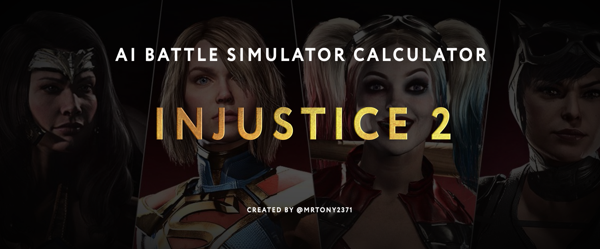

I've created SQLlite database from my adventures in online AI Battle simulator in a fighting game Injustice 2.

Database stores info about chracter levels and their AI parameters. Then neural network predicts the match outcome based on fighter characteristics.
